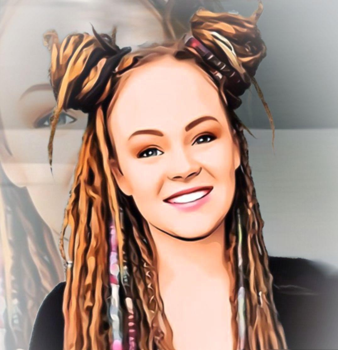

# PROJET ABC's 
_Creation d’une WebApp de recommandation de films_

## SOMMAIRE :

* [LE PROJET](#projet)
* [L'EQUIPE](#equipe)
* [NOTRE CLIENT (fictif)](#client)
* [NOTRE MISSION](#mission)
* [OUTILS](#outils)
* [BASES DE DONNEES](#bases-de-données)
* [STREAMLIT : INTERFACE DE LA WEB APP](#interface)

## LE PROJET

Le _PROJET ABC's_ est issu d’un projet d’école organisé par la __Wild Code School__. Il intervient dans le cadre de notre formation de Data Analyst, 2 mois après son début.

L’objectif de ce projet est le suivant :

Nous sommes une équipe de Data Analysts freelance.
Un cinéma en perte de vitesse situé dans la Creuse nous contacte ca rl a décidé de passer le cap du digital en créant un site Internet taillé pour les locaux.
Notre client nous demande de créer un moteur de recommandations de films qui à terme, enverra des notifications via internet.

Aucun client du cinéma n'ayant à ce jour renseigné ses préférences, nous sommes donc dans une situation de __cold start__. Cependant, notre client nous a fourni une base de données basée sur la plateforme IMDb.

## L'EQUIPE

Notre équipe est composée de 4 élèves issus de la promo Data Green de la __Wild Code School__ :
- [Aurore LEMAÎTRE](https://github.com/alema86)
- [Bérenger QUEUNE](https://github.com/BerengerQueune)
- [Christophe LEFEBVRE](https://github.com/clefebvre2021)
- [Stéphane ESSOUMAN](https://github.com/Liostephe)

Tous les quatre formons l'équipe ABC's Data.

## NOTRE CLIENT (fictif)

Notre cliente est Framboise de Papimcourt, petite fille du Comte de Montmirail. Elle a 25 ans et dirige un cinéma en perte de vitesse qui s'appelle "LE KINO".

Elle fait appelle à nous car elle est désespérée. Son cinéma ne fait pas de bénéfice, ses créanciers sont à sa porte et ses problèmes financiers sont tels qu'elle a dû demandé un nouveau prêt dans une banque alors que c'est contre ses principes.

Issue d'une famille de nobles, elle ne peut pas faire non plus appel à ses proches qui sont fortunés, car elle a renié sa famille. En effet ses derniers ne partagent pas sa vision des choses; exemple : elle est vegan alors que l'activité principale de sa famille est la chasse...

Elle diffusait initialement des films qui la touchaient afin d'essayer de partager sa vision du monde. Ainsi, la films diffusés étaient principalement des documentaires traitant de l'écologie, du féminisme et de la paix universelle.

Elle est obligée de faire changer de cap son cinéma et est prête à diffuser des films qui vont à l'encontre de ses convictions si ça lui permet de ne pas mettre la clé sous la porte et éviter d'être la raillerie de sa famille.
Faire du bénéfice à terme serait un plus, car ça lui permettrait d'offrir à ses futurs enfants Harmony, Safran et Kiwi un environnement dans lequel ils pourront s'épanouir comme elle en rêve.

Ainsi, elle nous donne carte blanche dans le rendu de notre travail.

## NOTRE MISSION

Nous devons fournir à notre client les outils d’analyse de la base de données issue de __IMDB__.

Nous devons :
- faire une rapide présentation de la base de données (sur notre Google Colab)
- fournir à notre client quelques statistiques sur les films :
  * Films : types, durées...
  * Acteurs : nombre de films, type de films...
- Présenter les TOP 10 des films par années et genre
- Présenter les TOP 5 des acteurs/actrices par années et genre
- Retourner une liste de films recommandés en fonction d'IDs ou de noms de films choisis par un utilisateur

- Il faudra entrapiner des outils de Machine Learning : 
	* Recommandation de films proches d’un film cible grâce à un modèle de __KNN__
	* proposition d’une rétrospective avec un modèle de __Régression Logistique__

## OUTILS

Le projet est entièrement fait sous **Python**.

Nous avons utilisés entres autres les librairies suivantes :
 - Pandas
 - Sklearn
 - Plotly
 - Streamlit

## BASES DE DONNEES

Comme énoncé ci-avant, notre client nous a fourni une base de données basée sur la plateforme IMDb. 
Nous pouvons les retrouver [**ici**](https://datasets.imdbws.com/), l'explicatif des datasets [**là**](https://www.imdb.com/interfaces/).

Nous laissons à dispositions notre analyse de ces bases de données sur un fichier colab[**fichier colab**](https://COLLAB)

## STREAMLIT : INTERFACE DE LA WEB APP

Nos prédictions sont mises à disposition au travers d’une __WebApp__ sur de la plateforme __Streamlit__.

Elle est hébergée directement sur les serveurs mis à disposition par *Streamlit* :

"Mettre URL de la web app"
